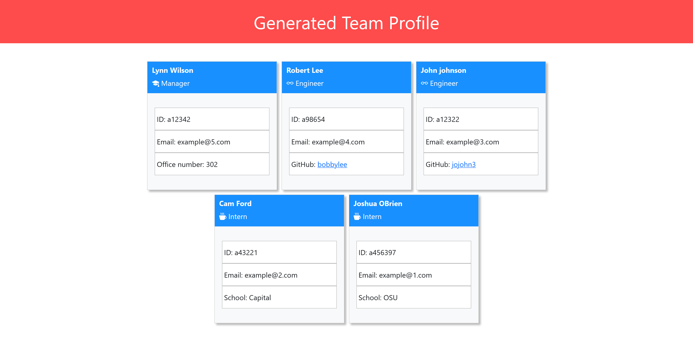

# ch-10-object-oriented-programming-team-profile-generator
OSU Bootcamp OOP challenge 

This application will help build a contact page for your company.

# Callout the following items

Name of employee
Job title
Id Number 
Email Address

# Installation
Use VS code to download what file you would like to create this application
copy and download SSH code into your file
run root "npm i"

Type "node ." within terminal
Answer questions the program asks. Some titles like Engineer and Manager will ask for github or office number and inter will ask for school.
The application will automatically generate your index.html within the "sample" folder

# Testing
Run "npm test" within the root directory of the application. The tests will automatically run and display the results.

# Questions

Reach me at the following email:

Email: joshuaobrien28@yahoo.com